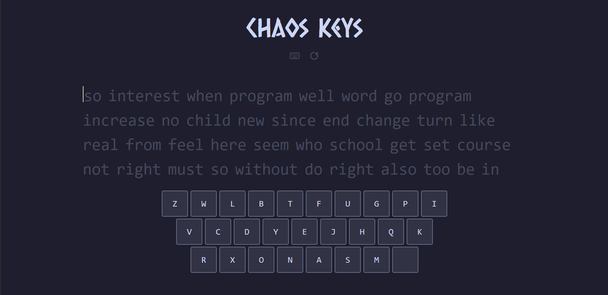
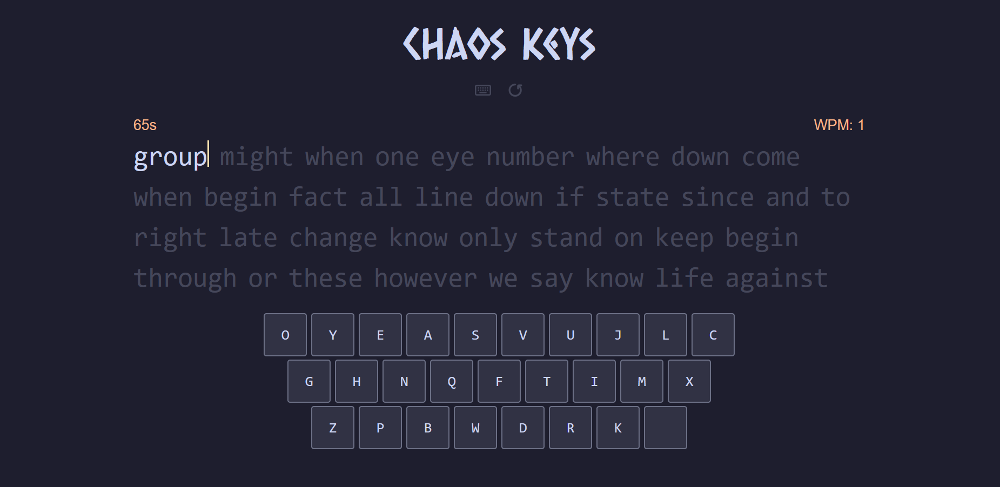
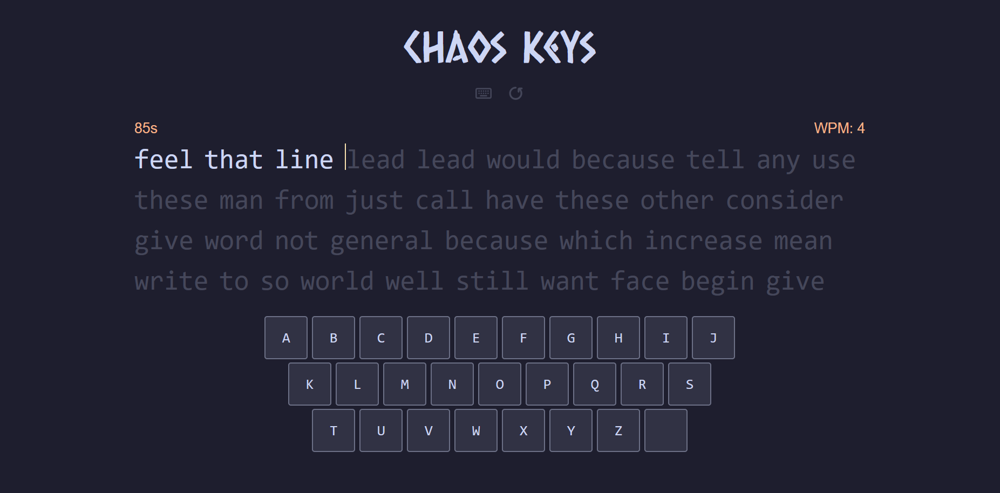

# Chaos Keys ⌨️
### Turning WPM to WTF
Try it out [here.](https://chaoskeys.onrender.com)


## Basic Details
### Team Name: 404 Use Not Found


### Team Members
- Alwin Pramod - College of Engineering Trivandrum
- Manukrishna M - College of Engineering Trivandrum

### Project Description
A typing test website that measures your WPM… but with a twist — the keyboard layout is jumbled or arranged alphabetically instead of QWERTY. Perfect for anyone who wants to destroy their typing muscle memory in the name of productivity… or not

### The Problem (that doesn't exist)
People are typing way too fast and accurately, leading to the catastrophic issue of… finishing work earlier. This surplus free time is a menace to society, and the only way to fix it is by making typing as slow, confusing, and frustrating as possible.

### The Solution (that nobody asked for)
We throw the keyboard layout out the window — literally! By jumbling up the keys or switching to a boring alphabetical layout, we make every typing session a wild guessing game. Say goodbye to muscle memory and hello to endless finger gymnastics, ensuring your typing speed plummets and your frustration skyrockets. Productivity? Never heard of it.

## Technical Details
### Technologies
- Languages used: HTML, CSS, JavaScript 
- Frameworks used: Svelte

### Implementation
For Software:
# Installation
```console
$ git clone https://github.com/LazyPluto/tinkerhub-useless-project
$ cd tinkerhub-useless-project
$ npm install
```

# Run
```console
$ npm run dev
$ # Open https://localhost:5137 in your browser 
```

### Project Documentation
For Software:

# Screenshots (Add at least 3)

Initial screen.


Test using randomized keyboard layout.


Test using alphabetic keyboard layout.

### Project Demo
# Video
[Watch the demo video](https://drive.google.com/file/d/1ksg5640VDFvUWtjOskLhF49fEIrAXZYC/view)
A pro typist battles scrambled keys and shattered muscle memory in a chaotic speed test.

## Team Contributions
- Alwin Pramod: Programming
- Manukrishna M: UI/UX design, art

---
Made with ❤️ at TinkerHub Useless Projects 


